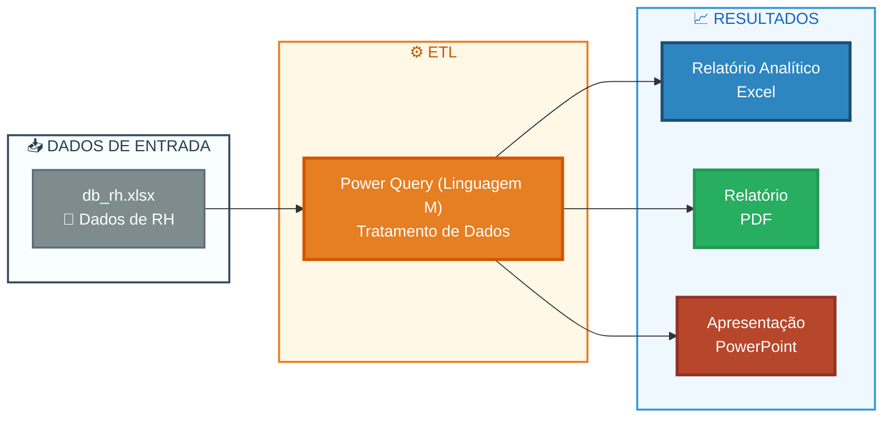

# 📊 Análise de Recursos Humanos - People Analytics

[](https://www.microsoft.com/excel) [](https://powerquery.microsoft.com/) 

## 🎯 Visão Geral

Este projeto oferece uma análise estratégica do quadro de funcionários de uma empresa para gerar insights estratégicos e apoiar decisões de RH com People Analytics.

## 📋 **[Ver Relatório](reports/rh_relatorio.pdf)**

> **Relatório analítico de RH sobre composição da equipe, desempenho, satisfação, recrutamento e salários, com recomendações para reduzir desligamentos e fortalecer a gestão da equipe.**

## 🏗️ Arquitetura da Solução  



## 📁 Estrutura do Projeto

```text
people_analytics_excel/
│
├── data/
│   └── raw/                         # Dados brutos
│       └── db_rh.xlsx
│
├── reports/                         # Relatórios
│   ├── rh_analises_v1.0.xlsx
│   ├── rh_relatorio.pdf
│   └── rh_apresentacao_v1.pptx
│
├── assets/                          # Recursos visuais
│   ├── 1_slide_apresentacao.png
│   ├── 2_slide_apresentacao.png
│   ├── 3_slide_apresentacao.png
│   ├── 4_slide_apresentacao.png
│   ├── 5_slide_apresentacao.png
│   └── 6_slide_apresentacao.png
│
├── docs/                            # Documentação
│   └── dicionario_dados.md
│
└── README.md
```

## 📚 Documentação e Recursos

| Recurso | Descrição | Link |
|---------|-----------|------|
| 📊 **Planilha de Análises** | Arquivo Excel com  as análises realizadas para suporte às respostas | [rh_analises_v1.0.xlsx](reports/rh_analises_v1.0.xlsx) |
| 📋 **Relatório** | Documento em PDF com as respostas | [rh_relatorio.pdf](reports/rh_relatorio.pdf) |
| 🎨 **Apresentação** | Arquivo PowerPoint para stakeholders | [rh_apresentacao_v1.pptx](reports/rh_apresentacao_v1.pptx) |
| 📖 **Dicionário de Dados** | Documento técnico com definições e especificações dos campos de dados | [dicionario_dados.md](docs/dicionario_dados.md) |
